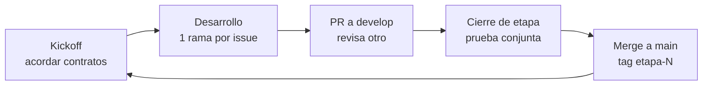
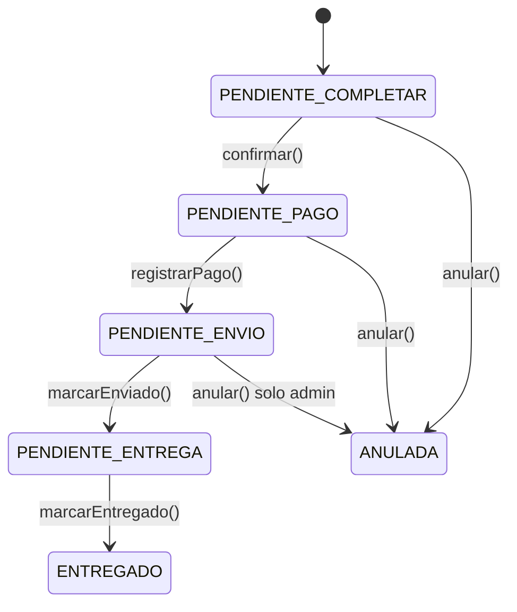

# Plan de trabajo – E-Commerce Zero

Sep 23, 2026 · @Maxi

## Cómo vamos a trabajar

El proyecto se hace **por etapas**. Cada etapa tiene un grupo de issues que se pueden hacer **en paralelo**, porque solo dependen de lo que se cerró en etapas anteriores. Cada issue es una **rebanada vertical**: el responsable hace service, controller, vista y prueba de esa funcionalidad completa. No hay dueños de módulos, así que las áreas rotan entre los cuatro.

La Etapa 0 crea **todas las entidades JPA y repositorios del diagrama** y el **template Bootstrap 5 integrado**. Con eso, desde la Etapa 1 nadie espera a que otro haga una entidad o una pantalla base.

### Ciclo de cada etapa



1. **Kickoff (juntos).** Cada uno lee sus issues y se acuerdan los contratos marcados en la etapa: firmas de métodos, URLs y nombres de fragments.
2. **Desarrollo.** Una rama por issue, con el nombre `feature/E2-04-registro`. Cada uno toma un issue por vez; recién al terminarlo pasa al siguiente suyo de la misma etapa.
3. **Pull Request a `develop`.** Lo revisa y prueba **otro integrante**, nunca el autor. El revisor verifica el criterio de aceptación y que la vista respete el template.
4. **Cierre de etapa (juntos).** Se levanta `develop`, se prueba el flujo completo, se corrigen bugs y se hace merge a `main` con el tag `etapa-N`.
5. **Si alguien termina antes:** revisa PRs, escribe tests de sus issues o documenta en el informe los patrones que usó. No se adelantan issues de la etapa siguiente.

### Trello y GitHub

- Cada issue de este documento se carga como **issue de GitHub** y como **tarjeta de Trello**, con el mismo ID (ej: `E3-02`).
- Columnas de Trello: **Pendiente → En progreso → Probada** (PR revisado por otro) **→ Finalizada** (mergeada en `develop`).
- Las etiquetas de tipo son **Back**, **Front** y **Back + Front**, y cada etapa tiene su propia etiqueta.
- El historial del tablero se muestra en la exposición, así que no borren tarjetas.

### Formato de cada issue

Cada issue indica:

- **Responsable.**
- **Tipo:** Back, Front o Back + Front.
- **Depende de:** los issues que tienen que estar mergeados antes.
- **Descripción:** qué hay que construir y cómo.
- **Criterio de aceptación:** lo que el revisor tiene que poder probar para aprobar el PR.

Algunos issues llevan además una marca de espera, para lo que depende de otro issue **de la misma etapa**:

- **ESPERAR a E0-01:** no se arranca hasta que ese issue esté mergeado en `develop`.
- **ESPERAR firma de E4-01:** alcanza con que el otro haya subido la firma del método con una implementación vacía (stub). Se programa contra esa firma y se prueba cuando llegue la versión real.

Lo que depende de etapas anteriores no lleva marca, porque ya está cerrado cuando la etapa arranca.

## Decisiones de diseño

Estas decisiones están cerradas y todos los issues las siguen. Donde el diagrama y los requerimientos funcionales difieren, manda el diagrama.

### Carrito, ventas y compras a proveedor

- **`OrdenCompra` es el carrito del cliente**, como dice la nota del diagrama. No se usa para comprarle a proveedores.
- **La compra a un proveedor es una `FacturaProveedor`** con sus `DetalleFactura` (producto, cantidad, precio de costo). Esto cubre el RF25 y el RF26.
- **La venta es una `FacturaCliente`**, creada desde la `OrdenCompra` al confirmar el carrito. Cada `DetalleFactura` guarda el precio vigente en ese momento, así un cambio de precio posterior no altera ventas pasadas.
- **Número de factura:** secuencial por tipo de factura, simulando la numeración validada por ARCA.

### Stock

- **El stock se guarda como movimientos.** Cada `Stock` nace de un `DetalleFactura` (`crearStock(idDetalleFactura)`) y su `cantidadActual` es el **saldo después del movimiento**. El stock actual de un producto es el `cantidadActual` de su último movimiento, o 0 si no tiene.
- **El signo lo decide la factura por polimorfismo.** `Factura` declara el método abstracto `getSignoStock()`: `FacturaProveedor` devuelve `+1` y `FacturaCliente` devuelve `-1`.
- **Cuándo se mueve:** sube cuando una compra a proveedor se marca como recibida, y baja cuando se registra el pago de una venta (RF13).
- **Reversión:** anular una venta ya pagada genera un movimiento inverso sobre el mismo detalle, con la observación "Anulación".
- **Nunca queda negativo:** `StockService` rechaza cualquier movimiento que deje el saldo por debajo de 0.
- **Cada talle es un producto distinto.** `Producto` tiene un solo `talle` y el stock es por producto, así que "Remera Zero M" y "Remera Zero L" son dos productos con códigos distintos.

### Estados



El diagrama muestra el flujo de la `OrdenCompra`, que es lineal para no agregar atributos de tipo de entrega.

- **"Pago realizado"** no está en el enum del diagrama. Se representa con la `FacturaCliente` en `PAGADA`, y la pantalla de seguimiento lo muestra como un paso más.
- **Factura:** `SIN_DEFINIR` mientras espera el pago, `PAGADA` cuando se paga y `ANULADA` si se anula.
- **Compras a proveedor:** se crean en `SIN_DEFINIR`, que significa "pedida". Al marcarlas como recibidas pasan a `PAGADA` y ahí se genera el stock. Una compra no recibida se puede anular.

### Anulación (RF19)

- **El cliente** puede anular mientras la orden esté en `PENDIENTE_COMPLETAR` o `PENDIENTE_PAGO`. Como el stock todavía no se descontó, no hay que revertir nada.
- **El administrador** puede anular también en `PENDIENTE_ENVIO`. La factura pasa a `ANULADA` y se reingresa el stock con movimientos inversos.
- Desde `PENDIENTE_ENTREGA` en adelante no se puede anular.

### Pagos (RF18)

| Tipo de pago | Cómo se confirma |
| --- | --- |
| `EFECTIVO` | El administrador confirma el cobro desde el panel de pedidos. |
| `TRANSFERENCIA` | El administrador confirma la acreditación desde el panel de pedidos. |
| `BILLETERA_VIRTUAL` (Mercado Pago) | Pantalla de pago simulado con botón "Pagar", que confirma en el momento. |

No se integra la API real de Mercado Pago. La simulación queda aislada en un método, así se puede reemplazar sin tocar el resto.

### Reporte de stock (RF29)

- **El 100 % de un producto** es el saldo que quedó después de su **última recepción de mercadería**. Se calcula con lo que ya tiene el diagrama. Porcentaje = stock actual ÷ ese saldo.
- **Estados:** Bueno, más del 50 %. Regular, entre 20 % y 50 %. Malo, menos del 20 %. Un producto que nunca recibió mercadería no entra en el reporte.
- **Sucursal:** en el diagrama, `Stock` no está relacionado con `Empresa`. Todo el stock pertenece a la empresa de tipo `SEDE_CENTRAL`, y el reporte muestra su nombre como sucursal.
- **Reposición por WhatsApp (RF30):** se piden las unidades que faltan para llegar al 50 % de ese 100 %, al proveedor con el precio de costo más bajo del producto.

### Usuarios y roles

- **Roles del diagrama:** `JEFE`, `ADMINISTRATIVO` y `CLIENTE`.
- **JEFE** accede a todo el panel.
- **ADMINISTRATIVO** accede a todo el panel **excepto** el ABM de usuarios empleados y la configuración de empresa y correo.
- **CLIENTE** accede al sitio público, a su perfil y a sus compras.
- **Usuarios del panel:** son `Empleado`, con `tipoEmpleado` igual a su rol. Los clientes son `Cliente`. En los dos casos, el `nombreUsuario` es el correo.
- **Activación de cuenta (RF02):** es el único atributo que se agrega al diagrama. `Usuario` suma `codigoActivacion`. Mientras tenga valor, la cuenta está inactiva y no puede iniciar sesión; al activarse se pone en `null`.
- **Perfil obligatorio:** un cliente sin perfil completo puede navegar y armar el carrito, pero no puede confirmar la compra.
- **Dirección de entrega:** la `Direccion` de su perfil.

### Precios (RF11 y RF12)

- **Vigencias:** el precio vigente es la `VigenciaPrecio` con `fechaHasta` nula, según la nota del diagrama. Cargar un precio nuevo cierra automáticamente la vigencia anterior.
- **Actualización periódica:** el sistema no aplica aumentos solo, porque el porcentaje de inflación lo decide la tienda. Hace dos cosas:
  - Un scheduler marca con una alerta en el dashboard los productos cuyo precio lleva más de 2 meses sin cambiar.
  - Una pantalla de actualización masiva aplica un porcentaje por categoría, subcategoría o a todo el catálogo.

### Otros

- **Proveedor:** el diagrama le copió los métodos de `Cliente`. Se implementa con `razonSocial` y su colección de `Contacto`, con al menos un correo y un teléfono celular para WhatsApp (RF24).
- **Parámetros mal tipeados:** se ignoran los parámetros del diagrama que no corresponden, como `tipoEmpleado` en `crearCliente`. `Cliente.direccionEstadia` se deja como campo opcional sin uso.
- **Newsletter:** se envía a todos los clientes activos con perfil completo.
- **Propuesta de mejora:** el enunciado dice "software de gimnasios", que parece un error de copia de otro trabajo. Se investigan e-commerce deportivos (Adidas, Puma, Vaypol, Indeme) y se propone una funcionalidad para Zero.

## Convenciones técnicas

Estas reglas se definen en la Etapa 0 y no se cambian durante el proyecto. El revisor de cada PR rechaza lo que no las cumpla.

### Stack

- **Java + Spring Boot** con estas dependencias: Web, Thymeleaf, Data JPA, Security, Validation y Mail.
- **Vista:** Thymeleaf Layout Dialect y Thymeleaf Extras Spring Security.
- **Base de datos:** SQLite con `sqlite-jdbc` y `hibernate-community-dialects`, usando `spring.jpa.database-platform=org.hibernate.community.dialect.SQLiteDialect` y `ddl-auto=update`.
- **Un solo repositorio** para todo el proyecto. El archivo de la base va en `./data/zero.db` y está en el `.gitignore`: cada uno tiene su base local, que el `DataSeeder` puebla al arrancar.

### Estructura de paquetes

```
com.zero.ecommerce
 ├─ config        seguridad, mail, scheduling, DataSeeder
 ├─ entity        entidades JPA
 │   └─ enums
 ├─ repository    DAO: interfaces Spring Data JPA
 ├─ service       lógica de negocio y validaciones
 ├─ dto           reportes, dashboard, catálogo
 ├─ controller
 │   ├─ publico
 │   ├─ cliente
 │   └─ admin
 ├─ scheduler     newsletter, alertas de precio
 └─ exception     ErrorServiceException y handler global

resources/templates: layout/  fragments/  publico/  cliente/  admin/  email/  error/
resources/static:    vendor/template/  css/zero.css  js/  img/
```

### Reglas de código

- **Capas y MVC.** Un controller nunca usa un repository: siempre pasa por un service. Los services no conocen nada de la vista.
- **Inyección de dependencia** por constructor en todas las clases. No se usa `@Autowired` sobre atributos.
- **Entidad base.** Todas las entidades extienden `BaseEntity`, con `id` String (UUID) y `eliminado` boolean.
- **Baja lógica.** `eliminarX()` pone `eliminado=true`, y `listarXActivo()` filtra por `eliminado=false`. No se borra nada físicamente.
- **Validaciones.** Cada service tiene su `validar(...)`, que lanza `ErrorServiceException` con un mensaje legible en español. El controller lo atrapa y lo muestra con un mensaje flash del kit de componentes.
- **Herencias** (`Persona`, `Factura`, `Contacto`): `@Inheritance(strategy = InheritanceType.JOINED)`.
- **Nombres** según el diagrama: `crearProducto`, `buscarProductoPorCodigo`, `listarProductoActivo`.
- **Rutas:** `/admin/...` para el panel, `/cliente/...` para lo del cliente logueado y el resto es público.

### Reglas del template Bootstrap 5

- **Un solo template.** Se usa el template Bootstrap 5 que elija el equipo. Si todavía no está elegido, se usa **AdminLTE 4**, que es gratuito y trae el dashboard y todos los componentes. El sitio público se arma con los mismos componentes y la misma paleta.
- **Assets:** los archivos del template van en `static/vendor/template/` y no se modifican. Los ajustes de marca van en `static/css/zero.css`, como overrides de variables CSS.
- **Layouts:** toda vista nueva decora uno de los dos layouts (`layout/publico.html` o `layout/admin.html`) con `layout:decorate`. Nadie arma un `<head>` propio.
- **Componentes:** tablas, formularios, botones, badges, cards, modales y alertas se toman del **kit de componentes** (issue E0-03). Si hace falta algo que no está en el kit, se agrega al kit primero.
- **Clases:** se usan las clases del template y de Bootstrap. No hay estilos inline ni CSS por página.
- **Colores de estado:** los estados usan siempre el mismo badge y color en todo el sistema. Se definen una sola vez en el kit.
- **Responsive:** el sitio público tiene que funcionar en celular. El revisor lo prueba con el modo responsive del navegador.

### Patrones y dónde aparecen

| Patrón | Dónde aparece |
| --- | --- |
| Capas / MVC | Estructura completa: controller → service → repository, con vistas Thymeleaf |
| DAO / ORM | Repositorios Spring Data JPA sobre entidades |
| DTO | Reportes, dashboard y catálogo público |
| Inyección de dependencia | Constructores de services, controllers y schedulers |
| Polimorfismo | `Factura.getSignoStock()`, jerarquías de `Contacto` y `Persona` |
| Creador | `OrdenCompra` crea sus `DetalleCompra`; `Factura` crea sus `DetalleFactura` |
| Experto | `OrdenCompra` calcula su total y sus transiciones; `VigenciaPrecio` sabe si está vigente |
| Alta cohesión / Bajo acoplamiento | Un service por agregado; los services se comunican por interfaces públicas |

Con esto se cubren los 5 patrones mínimos que pide el enunciado. Cada responsable documenta en el informe los que aplicó en sus issues.

## Etapa 0 – Cimientos

Esta etapa deja listos el proyecto, todas las entidades y el template integrado. Maxi arranca con E0-01 y, apenas lo sube a `develop`, los demás crean sus ramas desde ahí. E0-06 se hace al final, cuando el resto ya está mergeado.

**Contratos a acordar en el kickoff:**

- Nombres de los dos layouts: `layout/publico.html` y `layout/admin.html`.
- Nombres de los fragments del kit.
- Firma de `ErrorServiceException`.

| ID | Issue | Responsable | Tipo |
| --- | --- | --- | --- |
| E0-01 | Proyecto base y configuración | Maxi | Back |
| E0-02 | Integración del template: layouts público y admin | Valen | Front |
| E0-03 | Kit de componentes del template | Valen | Front |
| E0-04 | Entidades y repositorios: personas, ubicación y empresa | Diego | Back |
| E0-05 | Entidades y repositorios: catálogo, ventas y proveedores | Manu | Back |
| E0-06 | CRUD de referencia (Nacionalidad) | Maxi | Back + Front |

### E0-01 · Proyecto base y configuración

**Responsable:** Maxi · **Tipo:** Back · **Depende de:** nada

- Crear el proyecto Spring Boot con las dependencias del stack.
- Configurar `application.properties` para SQLite, con la base en `./data/zero.db`.
- Crear la estructura de paquetes de las convenciones.
- Crear `BaseEntity` como `@MappedSuperclass`, con `id` UUID generado y `eliminado`.
- Crear `ErrorServiceException` y un `@ControllerAdvice` que, ante una excepción de negocio, vuelva a la página con un mensaje flash.
- Crear `DataSeeder` como `CommandLineRunner`, con un método por grupo de datos (vacío por ahora), donde cada uno va agregando lo suyo.
- Dejar Spring Security configurado con `permitAll()` **temporal**, para que nadie se bloquee hasta E1-01.
- Crear las ramas `main` y `develop`, protegidas para exigir PR. Agregar el `.gitignore` con `data/` y `target/`.
- Escribir un `README` con cómo correr el proyecto y un link a este documento.

**Criterio de aceptación:** cualquiera clona, corre el proyecto sin tocar nada, la app levanta y se crea el archivo `.db`.

### E0-02 · Integración del template: layouts público y admin

**Responsable:** Valen · **Tipo:** Front · **Depende de:** E0-01

**ESPERAR a E0-01** (Maxi): el esqueleto del proyecto.

- Copiar los assets del template (CSS, JS, fuentes e íconos) a `static/vendor/template/`.
- Crear `static/css/zero.css` con la paleta de la marca Zero como overrides de variables. Deportivo: negro, blanco y un color de acento.
- **`layout/admin.html`**, a partir del dashboard del template:
  - Sidebar con todas las secciones del panel: Inicio, Usuarios, Productos, Precios, Categorías, Proveedores, Compras a proveedor, Pedidos, Newsletter, Reportes (Ventas, Stock, Proveedores) y Configuración (Empresa, Correo, Formas de pago, Ubicación, Nacionalidades).
  - Topbar con el nombre del usuario logueado y el botón de logout.
  - Breadcrumb y título de página configurables desde cada vista.
- **`layout/publico.html`**, con los mismos componentes:
  - Header con el logo Zero y un menú de categorías con dropdown (Niños, Niñas, Mujeres, Hombres → Ropa, Calzado, Accesorios). En esta etapa es estático; en E3-04 pasa a ser dinámico.
  - Accesos a Ofertas, carrito con contador, "Ingresar" y "Mi cuenta".
  - Footer con datos de contacto.
- Páginas de error 403, 404 y 500 en `error/`, con el estilo del template.
- Una página de ejemplo de cada layout en `/dev/ejemplo-publico` y `/dev/ejemplo-admin`.

**Criterio de aceptación:** una vista nueva con solo `layout:decorate` y un bloque de contenido se ve con el template completo, en escritorio y en celular.

### E0-03 · Kit de componentes del template

**Responsable:** Valen · **Tipo:** Front · **Depende de:** E0-02

**ESPERAR a E0-02** (Valen): los layouts del template.

Crear en `fragments/` los componentes que usa todo el proyecto, tomados del template:

- `mensajes`: alertas flash de éxito y error.
- `tabla`: tabla de listado con columna de acciones (ver, editar, eliminar) y estado vacío.
- `formulario`: inputs con label y error de validación, selects, checkbox y botones Guardar y Cancelar.
- `modal-confirmar`: modal de confirmación de baja, reutilizable con un parámetro de URL.
- `paginacion`.
- `card-producto`: imagen, nombre, precio y badge de oferta.
- `badge-estado`: un color fijo por cada estado de `OrdenCompra` y de `Factura`.
- `filtros`: barra de filtros para listados y reportes, con fechas, selects y botón Buscar.
- `kpi`: tarjeta de indicador para el dashboard.

Armar una página `/dev/componentes` que muestre cada fragment con un ejemplo de uso y el código para copiarlo. Documentar en el `README` cómo se incluye cada uno.

**Criterio de aceptación:** la página de componentes muestra todos los fragments funcionando, y cada uno se usa con una sola línea `th:replace`.

### E0-04 · Entidades y repositorios: personas, ubicación y empresa

**Responsable:** Diego · **Tipo:** Back · **Depende de:** E0-01

**ESPERAR a E0-01** (Maxi): el esqueleto y `BaseEntity`.

Mapear con JPA, con atributos, enums y relaciones del diagrama:

- **Ubicación:** `Pais` → `Provincia` → `Departamento` → `Localidad` (con `codigoPostal`) → `Direccion`.
- **Personas:** `Persona` abstracta con herencia JOINED hacia `Cliente` (relacionado con `Nacionalidad`) y `Empleado`. `Persona` se relaciona con `Usuario`, `Direccion`, `ContactoTelefonico` e `Imagen`.
- **Usuario:** con `codigoActivacion`, según las decisiones de diseño.
- **Contactos:** `Contacto` abstracta con JOINED hacia `ContactoCorreoElectronico` y `ContactoTelefonico`.
- **Otras:** `Nacionalidad`, `Imagen` (con `@Lob byte[] contenido` y `mime`), `Empresa` (relacionada con `Direccion` y `Contacto`) y `ConfiguracionCorreoEmpresa` (1 a 1 con `Empresa`).
- **Enums:** `RolUsuario`, `TipoTelefono`, `TipoContacto`, `TipoImagen`, `TipoEmpresa`, `TipoEmpleado` y `TipoDocumento`.

Crear un repository por entidad, con las búsquedas que pide el diagrama. Por ejemplo:

- `findByNombreAndEliminadoFalse`
- `findAllByEliminadoFalseOrderByNombre`
- `findByProvinciaIdAndEliminadoFalse`
- `findByNombreUsuario`
- `findByCodigoPostal`

**Criterio de aceptación:** la app levanta, Hibernate crea todas las tablas con sus claves foráneas y el proyecto compila junto con E0-05.

### E0-05 · Entidades y repositorios: catálogo, ventas y proveedores

**Responsable:** Manu · **Tipo:** Back · **Depende de:** E0-01

**ESPERAR a E0-01** (Maxi): el esqueleto y `BaseEntity`.

Mapear con JPA, con atributos, enums y relaciones del diagrama:

- **Catálogo:** `Categoria` → `SubCategoria` → `Producto` (relacionado con `Imagen`), y `VigenciaPrecio` (varias por producto).
- **Stock:** `Stock`, relacionado con `DetalleFactura` y con el producto de ese detalle. También guarda la fecha del movimiento, para ordenar.
- **Carrito:** `OrdenCompra`, en composición con `DetalleCompra` (`cascade = ALL`, `orphanRemoval = true`) y relacionada con `Cliente`. `DetalleCompra` se relaciona con `Producto`.
- **Facturas:** `Factura` abstracta, con JOINED hacia `FacturaCliente` (relacionada con `OrdenCompra`, `Cliente` y `Empleado`) y `FacturaProveedor` (relacionada con `Proveedor`). `Factura` tiene composición con `DetalleFactura` y se relaciona con `FormaDePago`.
- **Proveedor:** con una colección de `Contacto`.
- **Enums:** `EstadoOrdenCompra`, `EstadoFactura` y `TipoPago`.
- **Método abstracto** `getSignoStock()` en `Factura`, implementado en las dos subclases.

Crear un repository por entidad, incluyendo:

- En `Stock`: el último movimiento de un producto, ordenado por fecha descendente.
- En `VigenciaPrecio`: la vigencia de un producto con `fechaHasta` nula.
- En `OrdenCompra`: la orden de un cliente en un estado dado.
- En `Factura`: el número máximo por tipo, para la numeración.

**Criterio de aceptación:** la app levanta con todas las tablas creadas y el proyecto compila junto con E0-04.

### E0-06 · CRUD de referencia (Nacionalidad)

**Responsable:** Maxi · **Tipo:** Back + Front · **Depende de:** E0-03, E0-04

**ESPERAR a E0-03** (Valen) y **a E0-04** (Diego): el kit de componentes y la entidad `Nacionalidad`.

Hacer el ABM completo de `Nacionalidad` como **modelo que copian todos los ABM del proyecto**:

- `NacionalidadService` con los métodos del diagrama: crear, validar (nombre obligatorio y sin duplicados), modificar, eliminar (baja lógica), buscar, listar y listar activos.
- `NacionalidadController` en `/admin/nacionalidades`, con listado, alta, edición y baja.
- Vistas con el layout admin y los fragments del kit: tabla, formulario, modal de confirmación y mensajes flash.
- Un test unitario del service con JUnit + Mockito, que valide el caso de duplicado.
- Cargar en el seeder las nacionalidades más comunes.
- Documentar en el `README` el paso a paso para crear un ABM nuevo a partir de este.

**Criterio de aceptación:** el ABM funciona completo, muestra el error de duplicado con el mensaje flash y los demás pueden copiar su estructura.

## Etapa 1 – Servicios transversales

Esta etapa construye las piezas que usan todas las siguientes: seguridad, ubicación, categorías, imágenes, correo y formas de pago.

**Contratos a acordar en el kickoff:**

- `EmailService.enviar(destinatario, asunto, template, Map variables)`.
- URL de imágenes: `GET /imagen/{id}`.
- Endpoints JSON de ubicación y nombre del fragment de dirección: `fragments/direccion`.
- `UsuarioService.usuarioActual()`, que devuelve el usuario logueado.

| ID | Issue | Responsable | Tipo |
| --- | --- | --- | --- |
| E1-01 | Seguridad: login, encriptación y reglas por rol | Manu | Back + Front |
| E1-02 | Usuario logueado y menús por rol | Manu | Back + Front |
| E1-03 | ABM de ubicación | Diego | Back + Front |
| E1-04 | Fragment de dirección con selects en cascada | Diego | Back + Front |
| E1-05 | ABM de categorías y subcategorías | Valen | Back + Front |
| E1-06 | Servicio de imágenes | Valen | Back + Front |
| E1-07 | Empresa, configuración de correo y servicio de envío | Maxi | Back + Front |
| E1-08 | ABM de formas de pago | Maxi | Back + Front |

### E1-01 · Seguridad: login, encriptación y reglas por rol

**Responsable:** Manu · **Tipo:** Back + Front · **Depende de:** E0-02, E0-04

- Implementar `UserDetailsService` sobre `Usuario`, con el correo como `nombreUsuario`.
- Configurar `BCryptPasswordEncoder` como encriptador de claves (RF01).
- Rechazar el login de usuarios eliminados o con `codigoActivacion` pendiente, con un mensaje claro en cada caso.
- Pantalla de login con el layout público y el formulario del kit.
- Reglas de acceso (RF07), reemplazando el `permitAll()` temporal de E0-01:
  - `/admin/usuarios/**` y `/admin/configuracion/**` → solo `JEFE`.
  - Resto de `/admin/**` → `JEFE` o `ADMINISTRATIVO`.
  - `/cliente/**` → `CLIENTE`.
  - Todo lo demás, público.
- Después del login, redirigir según el rol: los empleados van a `/admin` y los clientes, a la home.
- Logout con redirección a la home.
- En el seeder, crear un `Empleado` JEFE y uno ADMINISTRATIVO con su usuario. Dejar las credenciales en el `README`.

**Criterio de aceptación:** un cliente que entra a `/admin` ve el error 403, un ADMINISTRATIVO no puede entrar a Usuarios y las claves en la base están hasheadas.

### E1-02 · Usuario logueado y menús por rol

**Responsable:** Manu · **Tipo:** Back + Front · **Depende de:** E1-01

**ESPERAR a E1-01** (Manu): la configuración de seguridad.

- Crear `UsuarioService` con los métodos del diagrama que no son ABM: buscar, buscar por nombre de usuario y `usuarioActual()`.
- Crear un `@ControllerAdvice` que exponga en todas las vistas el usuario logueado, su nombre para mostrar y su rol.
- En `layout/admin.html`, ocultar con `sec:authorize` las secciones que no corresponden al rol. Por ejemplo, Usuarios y Configuración solo las ve JEFE.
- En `layout/publico.html`, mostrar "Ingresar" a los visitantes y "Mi cuenta" con un dropdown (Mi perfil, Mis compras, Salir) a los clientes. A los empleados, mostrarles un acceso "Ir al panel".

**Criterio de aceptación:** los tres roles ven menús distintos y el nombre del usuario aparece en el topbar y en el header.

### E1-03 · ABM de ubicación

**Responsable:** Diego · **Tipo:** Back + Front · **Depende de:** E0-06

- Crear los services de `Pais`, `Provincia`, `Departamento` y `Localidad`, con los métodos del diagrama y copiando el modelo de E0-06.
- Validaciones: nombre obligatorio, sin duplicados dentro del mismo padre y código postal obligatorio en `Localidad`.
- Pantallas ABM en `/admin/configuracion/ubicacion`: una por entidad, con listado filtrable por el padre y formulario con select del padre.
- En el seeder, cargar Argentina, sus 24 provincias y los 18 departamentos de Mendoza, con las principales localidades de Gran Mendoza y sus códigos postales.

**Criterio de aceptación:** se puede crear una localidad nueva eligiendo país → provincia → departamento, y los duplicados se rechazan.

### E1-04 · Fragment de dirección con selects en cascada

**Responsable:** Diego · **Tipo:** Back + Front · **Depende de:** E1-03

**ESPERAR a E1-03** (Diego): los services de ubicación.

- Endpoints JSON públicos, en un controller `/api/ubicacion`:
  - `/provincias?pais=`
  - `/departamentos?provincia=`
  - `/localidades?departamento=`

  Cada uno devuelve un DTO con `id` y `nombre`, y el de localidades también el código postal.
- `DireccionService` con los métodos del diagrama: crear, validar, modificar y eliminar.
- Fragment `fragments/direccion.html`:
  - Selects en cascada en JavaScript: al elegir la provincia se cargan sus departamentos, y así sucesivamente.
  - El código postal se completa solo al elegir la localidad.
  - Campos de calle, numeración, barrio, manzana/piso, casa/departamento y referencia.
  - Recibe una dirección existente para precargar todos los selects al editar.
- Página de prueba en `/dev/direccion`.

**Criterio de aceptación:** el fragment se incluye con una línea, funciona al crear y al editar, y una dirección precargada muestra sus selects ya seleccionados.

### E1-05 · ABM de categorías y subcategorías

**Responsable:** Valen · **Tipo:** Back + Front · **Depende de:** E0-06

- Crear `CategoriaService` y `SubCategoriaService` con los métodos del diagrama.
- Validaciones: nombre obligatorio, sin duplicados, y en el caso de la subcategoría, sin duplicados dentro de la misma categoría.
- No permitir la baja de una categoría o subcategoría que tenga productos activos.
- ABM en `/admin/categorias`: listado de categorías con sus subcategorías agrupadas y alta de subcategoría eligiendo la categoría padre.
- En el seeder, cargar las 4 categorías y sus 3 subcategorías cada una, 12 en total (RF10).
- Método `listarArbolActivo()`, que devuelve categorías con sus subcategorías. Lo usa E3-04 para el menú público.

**Criterio de aceptación:** las 12 subcategorías aparecen agrupadas y no se puede eliminar una que tenga productos.

### E1-06 · Servicio de imágenes

**Responsable:** Valen · **Tipo:** Back + Front · **Depende de:** E0-04

- `ImagenService` con `crearImagen` y `modificarImagen`, que reciben un `MultipartFile`.
- Validaciones: formato JPG, PNG o WEBP, y tamaño máximo de 2 MB. Configurar el límite también en `spring.servlet.multipart`.
- Guardar `nombre`, `mime`, `contenido` y `tipoImagen`.
- Controller `GET /imagen/{id}`: devuelve los bytes con su content-type y cabeceras de caché.
- Imagen por defecto para productos y personas sin foto, en `static/img/`.
- Fragment `fragments/input-imagen`: input de archivo con vista previa antes de subir y con la imagen actual al editar.

**Criterio de aceptación:** se sube una imagen desde `/dev/imagen`, se ve por su URL y un archivo no permitido muestra el error de validación.

### E1-07 · Empresa, configuración de correo y servicio de envío

**Responsable:** Maxi · **Tipo:** Back + Front · **Depende de:** E1-04 (para la dirección de la empresa)

**ESPERAR a E1-04** (Diego): el fragment de dirección. Mientras tanto, Maxi hace E1-08.

- Crear `EmpresaService` y la pantalla `/admin/configuracion/empresa`, con razón social, CUIT (validando el formato), tipo, dirección (con el fragment de Diego) y contactos.
- Crear `ConfiguracionCorreoEmpresaService` y su pantalla, con correo, clave, puerto, SMTP y TLS. La clave no se muestra al editar.
- Crear `EmailService`:
  - Arma el `JavaMailSender` en tiempo de ejecución con la configuración guardada.
  - Procesa templates Thymeleaf de `templates/email/` como HTML.
  - Envía de forma asíncrona con `@Async`, y registra en el log si falla, sin romper la operación que lo llamó.
- Template `email/base.html` con encabezado y pie de la marca, con estilos inline compatibles con clientes de correo.
- Botón "Enviar correo de prueba" en la pantalla de configuración.
- En el seeder, cargar la empresa Zero como `SEDE_CENTRAL`.

**Criterio de aceptación:** con una cuenta real (Gmail con clave de aplicación o Mailtrap), el correo de prueba llega con el diseño de la marca.

### E1-08 · ABM de formas de pago

**Responsable:** Maxi · **Tipo:** Back + Front · **Depende de:** E0-06

- Crear `FormaDePagoService` con los métodos del diagrama: tipo de pago y observación.
- ABM en `/admin/configuracion/formas-pago`.
- Método `listarFormaDePagoActivo()`, que usa el checkout en E4-02.
- En el seeder, cargar Efectivo, Transferencia y Mercado Pago (como `BILLETERA_VIRTUAL`).

**Criterio de aceptación:** se pueden dar de alta, editar y desactivar formas de pago, y las inactivas no aparecen en `listarFormaDePagoActivo()`.

## Etapa 2 – Productos, precios y cuentas

Esta etapa arma el catálogo del lado del panel y todo el ciclo de vida de la cuenta del cliente.

**Contratos a acordar en el kickoff:**

- `StockService.buscarStockActual(idProducto): int`.
- `VigenciaPrecioService.buscarPrecioVigente(idProducto): double`.
- `ClienteService.buscarClientePorUsuario(idUsuario)` y `ClienteService.perfilCompleto(idUsuario): boolean`.
- **Regla de registro:** registrarse crea solo el `Usuario`. El `Cliente` se crea al completar el perfil, con `asociarClienteUsuario`.

Para probar sin esperar a otros issues, cada uno carga en el seeder los datos mínimos que necesita, como productos de prueba o un cliente con usuario activo.

| ID | Issue | Responsable | Tipo |
| --- | --- | --- | --- |
| E2-01 | ABM de productos | Maxi | Back + Front |
| E2-02 | Lectura de stock y catálogo de demostración | Maxi | Back |
| E2-03 | Precios con vigencias | Valen | Back + Front |
| E2-04 | Actualización masiva de precios por inflación | Valen | Back + Front |
| E2-05 | Registro y activación de cuenta | Manu | Back + Front |
| E2-06 | ABM de usuarios | Manu | Back + Front |
| E2-07 | Perfil del cliente | Diego | Back + Front |
| E2-08 | Cambio de clave y perfil obligatorio | Diego | Back + Front |

### E2-01 · ABM de productos

**Responsable:** Maxi · **Tipo:** Back + Front · **Depende de:** E1-05, E1-06

- `ProductoService` con los métodos del diagrama: crear, validar, modificar, eliminar, listar, listar activos, buscar por nombre y buscar por código.
- Validaciones: código único, nombre, descripción y talle obligatorios, subcategoría obligatoria e imagen obligatoria al crear (RF08).
- Listado en `/admin/productos` (RF09):
  - Filtros por categoría, subcategoría y "en oferta", y buscador por código o nombre.
  - Columnas: imagen miniatura, código, nombre, talle, subcategoría, oferta, precio vigente y stock actual.
  - Paginación.
- Formulario de alta y edición con el input de imagen del kit, selects de categoría → subcategoría y un switch de oferta.
- El precio y el stock se muestran como "sin precio" y 0 hasta que se mergeen E2-03 y E2-02.

**Criterio de aceptación:** se crea un producto completo con imagen, aparece en el listado, se puede filtrar y un código repetido se rechaza.

### E2-02 · Lectura de stock y catálogo de demostración

**Responsable:** Maxi · **Tipo:** Back · **Depende de:** E0-05

- `StockService` en su parte de lectura:
  - `buscarStockActual(idProducto)`: devuelve el `cantidadActual` del último movimiento del producto, o 0.
  - `listarStock()` y `buscarStock(id)`, según el diagrama.
  - La escritura se implementa en E3-03.
- Test unitario de `buscarStockActual`, con y sin movimientos.
- Seeder de catálogo de demostración:
  - Unos 20 productos repartidos en las 12 subcategorías, algunos en oferta y algunos en varios talles, siguiendo la decisión de un producto por talle.
  - Imágenes de ejemplo guardadas en `src/main/resources/seed/img/` y cargadas con `ImagenService`.

**Criterio de aceptación:** al levantar con la base vacía, el panel muestra los 20 productos con sus imágenes y stock 0.

### E2-03 · Precios con vigencias

**Responsable:** Valen · **Tipo:** Back + Front · **Depende de:** E0-05

- `VigenciaPrecioService` con los métodos del diagrama.
- `crearVigenciaPrecio`:
  - Valida precio mayor a 0 y fecha desde igual o posterior a hoy.
  - Cierra la vigencia actual del producto con `fechaHasta` igual al día anterior.
  - Crea la nueva con `fechaHasta` nula.
- `buscarPrecioVigente(idProducto)`: devuelve el precio de la vigencia con `fechaHasta` nula.
- En `VigenciaPrecio`, un método `estaVigente(fecha)`, aplicando el patrón Experto.
- Pantalla `/admin/precios` (RF11):
  - Listado de productos con su precio vigente y la fecha desde.
  - Al elegir un producto, su historial completo de vigencias y un formulario para cargar un precio nuevo.
- En el seeder, dar precios iniciales a todos los productos de demostración.
- Test unitario del cierre automático de la vigencia anterior.

**Criterio de aceptación:** después de tres cambios de precio, el historial muestra las tres vigencias sin superponerse y el precio vigente es el último.

### E2-04 · Actualización masiva de precios por inflación

**Responsable:** Valen · **Tipo:** Back + Front · **Depende de:** E2-03

**ESPERAR a E2-03** (Valen): `crearVigenciaPrecio` con el cierre automático.

- Método `actualizarPreciosMasivo(alcance, idAlcance, porcentaje, fechaDesde)`, con alcance igual a todo el catálogo, una categoría o una subcategoría.
- Por cada producto del alcance, crea una vigencia nueva con el precio aumentado usando `crearVigenciaPrecio`, así se reutiliza el cierre de la anterior.
- Todo en una sola transacción: si falla un producto, no se aplica ninguno.
- Redondeo del precio nuevo a múltiplos de $10.
- Pantalla `/admin/precios/actualizacion` (RF12):
  - Se elige el alcance, el porcentaje y la fecha desde.
  - Vista previa en tabla: producto, precio actual, precio nuevo y diferencia.
  - Botón de confirmar con modal.

**Criterio de aceptación:** un aumento del 15 % a "Hombres" cambia solo esos productos, y la vista previa coincide con lo que se guarda.

### E2-05 · Registro y activación de cuenta

**Responsable:** Manu · **Tipo:** Back + Front · **Depende de:** E1-01, E1-07

- En `UsuarioService`, un método `registrarCliente(correo, clave, confirmacion)` (RF01):
  - Valida formato de correo, que no esté registrado, clave de al menos 8 caracteres y que la confirmación coincida.
  - Crea el `Usuario` con rol `CLIENTE`, la clave encriptada y un `codigoActivacion` aleatorio de 6 dígitos.
- Mail de activación (RF02): template `email/activacion.html`, con el código y un link a `/registro/activar?correo=...`.
- Página `/registro/activar`: se ingresan correo y código. Si coinciden, se pone el código en `null` y se redirige al login con un mensaje de cuenta activada.
- Opción "Reenviar código", que genera uno nuevo.
- Pantallas públicas de registro y de activación con el layout público.

**Criterio de aceptación:** un usuario se registra, recibe el mail, no puede loguearse antes de activar y sí puede después.

### E2-06 · ABM de usuarios

**Responsable:** Manu · **Tipo:** Back + Front · **Depende de:** E1-02

- Completar `UsuarioService` y `EmpleadoService` con los métodos de ABM del diagrama (RF06).
- Pantalla `/admin/usuarios`, visible solo para JEFE:
  - Listado de todos los usuarios, filtrable por rol y estado, con buscador por correo.
  - Alta de empleado: datos de `Empleado` (nombre, apellido, documento, fecha de nacimiento, tipo) más el usuario con su rol. Se crean juntos con `asociarEmpleadoUsuario`.
  - Edición de datos y rol, reseteo de clave (el JEFE define una clave nueva) y baja lógica.
- Reglas: un JEFE no puede darse de baja a sí mismo y siempre tiene que quedar al menos un JEFE activo.
- Para los clientes, solo se permite ver, dar de baja y reactivar. Sus datos los edita el propio cliente.

**Criterio de aceptación:** el JEFE crea un ADMINISTRATIVO que puede loguearse, le resetea la clave, y el sistema impide quedarse sin JEFES.

### E2-07 · Perfil del cliente

**Responsable:** Diego · **Tipo:** Back + Front · **Depende de:** E1-04, E1-06

- `ClienteService` con los métodos del diagrama, incluyendo `asociarClienteUsuario` y `buscarClientePorUsuario`.
- Pantalla `/cliente/perfil` (RF03 y RF05):
  - Datos: nombre, apellido, sexo, fecha de nacimiento, tipo y número de documento, y nacionalidad.
  - Dirección con el fragment de E1-04.
  - Teléfono, guardado como `ContactoTelefonico` de tipo celular.
  - Foto de perfil opcional, con el fragment de imagen.
- La primera vez se crea el `Cliente` y se asocia al usuario logueado. Las siguientes veces se modifica.
- Validaciones: campos obligatorios, mayor de edad y documento único.
- Para probar sin E2-05, usar en el seeder un usuario cliente ya activo.

**Criterio de aceptación:** un cliente carga todos sus datos, los edita, y la dirección queda relacionada con la localidad correcta.

### E2-08 · Cambio de clave y perfil obligatorio

**Responsable:** Diego · **Tipo:** Back + Front · **Depende de:** E2-07

**ESPERAR a E2-07** (Diego): `ClienteService` y la pantalla de perfil.

- En `UsuarioService`, implementar `modificarClave(id, claveActual, nuevaClave, confirmarClave)`, según el diagrama. Valida que la clave actual sea correcta y aplica las mismas reglas que el registro.
- Pantalla `/cliente/perfil/clave`.
- `ClienteService.perfilCompleto(idUsuario)`: verdadero si el cliente existe con datos, dirección y teléfono cargados.
- Aviso en la home y en el carrito para clientes con perfil incompleto, con un link a completarlo. El bloqueo real en el checkout lo hace E4-02, usando este método.
- Página "Mi cuenta" en `/cliente`, con accesos a Mi perfil, Cambiar clave y Mis compras (esta última se completa en E4-04).

**Criterio de aceptación:** el cambio de clave rechaza una clave actual incorrecta, y un cliente sin perfil ve el aviso.

## Etapa 3 – Abastecimiento y vidriera

Esta etapa hace entrar mercadería al stock y abre la tienda al público, con carrito incluido.

**Contratos a acordar en el kickoff:**

- `StockService.registrarMovimiento(DetalleFactura)` y `StockService.revertirMovimiento(DetalleFactura)`.
- `ProductoCatalogoDTO` (id, código, nombre, talle, imagen, precio, oferta, stock) y `CatalogoService.listar(filtro)`, que usan Valen y Diego.
- **Botón de agregar al carrito:** `POST /cliente/carrito/agregar` con `idProducto` y `cantidad`. Lo pone Valen en el detalle y lo implementa Manu.
- Fragment del contador del carrito en el header: `fragments/carrito-contador`.

| ID | Issue | Responsable | Tipo |
| --- | --- | --- | --- |
| E3-01 | ABM de proveedores con contactos | Diego | Back + Front |
| E3-02 | Buscador y filtros del catálogo público | Diego | Back + Front |
| E3-03 | Compras a proveedor | Maxi | Back + Front |
| E3-04 | Recepción de mercadería y movimientos de stock | Maxi | Back + Front |
| E3-05 | Home y catálogo por categoría | Valen | Back + Front |
| E3-06 | Detalle de producto y sección de ofertas | Valen | Back + Front |
| E3-07 | Carrito de compras | Manu | Back + Front |
| E3-08 | Carrito en el sitio: contador, acceso y retorno | Manu | Back + Front |

### E3-01 · ABM de proveedores con contactos

**Responsable:** Diego · **Tipo:** Back + Front · **Depende de:** E0-06

- `ProveedorService` con crear, validar, modificar, eliminar, buscar, listar y listar activos, **sobre la razón social y sus contactos**. No se usan los métodos copiados de `Cliente` del diagrama.
- Services de `ContactoCorreoElectronico` y `ContactoTelefonico` con los métodos del diagrama.
- Validaciones (RF24):
  - Razón social obligatoria y única.
  - Al menos un correo con formato válido.
  - Al menos un teléfono celular, guardado en formato internacional sin espacios ni signos (ej: `5492614123456`).
- Pantalla `/admin/proveedores`:
  - Listado con buscador.
  - Formulario con una lista dinámica de contactos, donde se agregan o quitan filas eligiendo tipo, valor y observación.
- Botón "WhatsApp" en cada fila, que abre `https://wa.me/{telefono}`.
- En el seeder, cargar 4 proveedores con sus contactos.

**Criterio de aceptación:** un proveedor sin teléfono celular se rechaza, y el botón de WhatsApp abre el chat del número correcto.

### E3-02 · Buscador y filtros del catálogo público

**Responsable:** Diego · **Tipo:** Back + Front · **Depende de:** E2-02, E2-03

**ESPERAR firma de E3-05** (Valen): `ProductoCatalogoDTO` y `CatalogoService.listar(filtro)`.

- En `CatalogoService`, implementar `buscar(texto, filtro)`, que busca por nombre o descripción entre los productos visibles: activos, con stock mayor a 0 y con precio vigente.
- Filtros combinables: rango de precio, talle y solo ofertas.
- Orden por menor precio, mayor precio, nombre o novedades.
- Barra de búsqueda en el header de `layout/publico.html`.
- Página de resultados `/buscar?q=`, con la grilla de cards del kit, los filtros en un panel lateral (colapsable en celular) y paginación.
- Los mismos filtros y orden se aplican en las páginas de categoría de E3-05, a través del mismo método de filtrado.

**Criterio de aceptación:** buscar "zapatilla" con filtro de talle 42 y orden por menor precio devuelve solo productos con stock, en el orden correcto.

### E3-03 · Compras a proveedor

**Responsable:** Maxi · **Tipo:** Back + Front · **Depende de:** E1-08, E2-01

- Service de `FacturaProveedor` con los métodos del diagrama (RF25):
  - `crearFactura` recibe proveedor, forma de pago y la lista de detalles (producto, cantidad y precio de costo unitario).
  - La factura crea sus `DetalleFactura` (patrón Creador) y calcula el total (patrón Experto).
  - Se asigna el número secuencial y el estado `SIN_DEFINIR`, que significa pedida.
  - Validaciones: al menos un detalle, cantidades y precios mayores a 0 y sin productos repetidos.
- Pantalla `/admin/compras`:
  - Listado con filtros por estado, proveedor y rango de fechas, con badge de estado.
  - Formulario de nueva compra, con proveedor y una tabla dinámica en JavaScript de detalles: producto (con buscador), cantidad, precio de costo, subtotal y total en vivo.
  - Vista de detalle de la compra.
- Al crear la compra, botón para avisar al proveedor por WhatsApp con el pedido armado como texto.

**Criterio de aceptación:** se crea una compra de 3 productos, el total coincide con la suma de subtotales y queda en estado pedida.

### E3-04 · Recepción de mercadería y movimientos de stock

**Responsable:** Maxi · **Tipo:** Back + Front · **Depende de:** E2-02, E3-03

**ESPERAR a E3-03** (Maxi): la creación de compras a proveedor.

- En `StockService`, la parte de escritura:
  - `registrarMovimiento(detalle)`: nuevo saldo = saldo actual + `cantidad × factura.getSignoStock()`, aplicando polimorfismo. Rechaza saldos negativos. Crea el `Stock` con el saldo, la fecha y la observación.
  - `revertirMovimiento(detalle)`: movimiento con el signo inverso, con la observación "Anulación".
  - `listarMovimientos(idProducto)`.
- Acción "Marcar como recibida" en la compra (RF26): la factura pasa a `PAGADA` y se registra un movimiento por cada detalle, todo en una transacción.
- Acción "Anular compra", solo para compras pedidas.
- En `/admin/productos`, la pantalla de detalle del producto muestra el stock actual y su historial de movimientos.
- Tests unitarios: entrada, salida, saldo negativo rechazado y reversión.
- En el seeder, crear y recibir compras de demostración, dejando productos en los tres niveles del reporte de stock.

**Criterio de aceptación:** recibir una compra de 20 unidades lleva el stock de 0 a 20, el historial muestra el movimiento, y una compra recibida no se puede recibir de nuevo.

### E3-05 · Home y catálogo por categoría

**Responsable:** Valen · **Tipo:** Back + Front · **Depende de:** E1-05, E2-02, E2-03

- `CatalogoService` y `ProductoCatalogoDTO`:
  - `listar(filtro)` devuelve solo productos activos, con stock mayor a 0 y precio vigente (RF14 y RF32).
  - Métodos por categoría y por subcategoría.
- Menú de categorías del header generado desde `listarArbolActivo()` de E1-05, reemplazando el menú estático de E0-02.
- Home `/`: banner principal, accesos a las 4 categorías, carrusel de productos en oferta y últimos productos agregados.
- Páginas `/catalogo/{categoria}` y `/catalogo/{categoria}/{subcategoria}`: breadcrumb, grilla de `card-producto` y paginación. Diego conecta ahí sus filtros en E3-02.
- Todo responsive y con los componentes del template.

**Criterio de aceptación:** un visitante navega Hombres → Calzado y solo ve productos con stock y precio. Un producto con stock 0 no aparece en ningún lado.

### E3-06 · Detalle de producto y sección de ofertas

**Responsable:** Valen · **Tipo:** Back + Front · **Depende de:** E3-05 (el DTO y el service)

**ESPERAR a E3-05** (Valen): `CatalogoService` y el DTO.

- Página `/producto/{id}` (RF15):
  - Imagen grande, nombre, código, descripción, talle, precio y stock disponible.
  - Otros talles del mismo modelo: productos con el mismo nombre y distinto talle, como links.
  - Selector de cantidad con un máximo igual al stock, y el botón "Agregar al carrito" con el formulario del contrato.
  - Productos relacionados de la misma subcategoría.
  - Si el producto no tiene stock o está eliminado, se muestra un 404.
- Página `/ofertas` (RF16): productos en oferta con stock, con un badge de oferta y la misma grilla y filtros.

**Criterio de aceptación:** el detalle muestra el stock real y el selector no permite superarlo. `/ofertas` lista solo productos en oferta con stock.

### E3-07 · Carrito de compras

**Responsable:** Manu · **Tipo:** Back + Front · **Depende de:** E2-02, E2-03

- `CarritoService`, sobre la `OrdenCompra` del cliente en `PENDIENTE_COMPLETAR` (RF17):
  - `obtenerCarrito(idCliente)`: devuelve la orden abierta o crea una la primera vez.
  - `agregarProducto(idCliente, idProducto, cantidad)`: si el producto ya está, suma la cantidad.
  - `modificarCantidad`, `quitarProducto` y `vaciarCarrito`.
  - La orden crea sus `DetalleCompra` (patrón Creador).
  - Cada detalle calcula su subtotal con el precio vigente, y la orden calcula el total (patrón Experto).
  - Validaciones: el producto tiene que estar activo y con precio, y la cantidad no puede superar el stock actual.
- Endpoints en `/cliente/carrito`, incluido el `agregar` del contrato.
- Página del carrito: tabla con imagen, nombre, talle, precio unitario, cantidad editable, subtotal y quitar. Total, "Vaciar carrito" y "Continuar al pago" (este último se conecta en E4-02).
- Si al abrir el carrito un producto ya no tiene stock suficiente, se ajusta la cantidad y se avisa.

**Criterio de aceptación:** un cliente agrega, modifica y quita productos. Al cerrar sesión y volver a entrar, su carrito sigue igual.

### E3-08 · Carrito en el sitio: contador, acceso y retorno

**Responsable:** Manu · **Tipo:** Back + Front · **Depende de:** E1-02

- Fragment `fragments/carrito-contador`, con el ícono y la cantidad de ítems del carrito del cliente logueado, expuesto con el `@ControllerAdvice` de E1-02. Se incluye en el header público.
- Un visitante que toca "Agregar al carrito" va al login y, después de loguearse, vuelve al producto que estaba viendo. Se hace con el `SavedRequest` de Spring Security o un parámetro de retorno.
- Mensaje flash de confirmación al agregar, con un link "Ver carrito".
- Los empleados no pueden usar el carrito: se les muestra el botón deshabilitado.

**Criterio de aceptación:** un visitante agrega un producto, se loguea, vuelve al producto con el ítem agregado y el contador del header se actualiza.

## Etapa 4 – Venta y postventa

Esta etapa cierra el circuito de venta: checkout, pago, factura, seguimiento, anulación, gestión de pedidos, newsletter y alertas de precio.

**Contratos a acordar en el kickoff.** Las firmas se definen en el kickoff; cada uno crea los métodos vacíos en su rama y los sube primero, para que el resto compile.

- **En `OrdenCompra` (E4-01, lo sube primero Maxi):** `confirmar()`, `registrarPago()`, `marcarEnviado()`, `marcarEntregado()`, `anular(boolean esAdmin)`, `puedeAnularse(boolean esAdmin)` y `pasosSeguimiento()`.
- **En `VentaService` (Manu):** `confirmarCompra(idCliente, idFormaPago)`, `registrarPago(idOrden)` y `anularVenta(idOrden, esAdmin)`.
- **En `NotificacionCompraService` (Diego):** `enviarConfirmacion(orden)` y `notificarCambioEstado(orden)`.

| ID | Issue | Responsable | Tipo |
| --- | --- | --- | --- |
| E4-01 | Estados y transiciones de la orden | Maxi | Back |
| E4-02 | Checkout y factura al cliente | Manu | Back + Front |
| E4-03 | Pago, descuento de stock y anulación de ventas | Manu | Back + Front |
| E4-04 | Historial y seguimiento de compras | Diego | Back + Front |
| E4-05 | Correos de la compra y anulación por el cliente | Diego | Back + Front |
| E4-06 | Panel de pedidos: listado y detalle | Maxi | Back + Front |
| E4-07 | Acciones sobre pedidos desde el panel | Maxi | Back + Front |
| E4-08 | Newsletter de ofertas | Valen | Back + Front |
| E4-09 | Alertas de actualización de precios | Valen | Back + Front |

### E4-01 · Estados y transiciones de la orden

**Responsable:** Maxi · **Tipo:** Back · **Depende de:** E0-05

- Implementar en `OrdenCompra` los métodos de transición del contrato, siguiendo el diagrama de estados de las decisiones de diseño. Es el patrón Experto: la orden sabe a qué estado puede pasar.
- Cada método valida el estado de origen y, si la transición no es válida, lanza `ErrorServiceException` con un mensaje claro. Por ejemplo, "No se puede enviar una orden sin pagar".
- `puedeAnularse(esAdmin)`:
  - El cliente puede en `PENDIENTE_COMPLETAR` y `PENDIENTE_PAGO`.
  - El administrador puede además en `PENDIENTE_ENVIO`.
- `pasosSeguimiento()`: devuelve la lista de pasos para la línea de tiempo (Pendiente de pago, Pago realizado, Pendiente de envío, Pendiente de entrega, Entregado), marcando cuáles están completos y cuál es el actual.
- Tests unitarios de todas las transiciones, válidas e inválidas.
- **Se sube a `develop` apenas los tests pasen**, porque E4-03, E4-04 y E4-07 lo usan.

**Criterio de aceptación:** los tests cubren cada transición, y una transición inválida lanza la excepción con su mensaje.

### E4-02 · Checkout y factura al cliente

**Responsable:** Manu · **Tipo:** Back + Front · **Depende de:** E1-08, E2-08, E3-07

**ESPERAR firma de E4-01** (Maxi) y **firma de E4-05** (Diego): `confirmar()` y `enviarConfirmacion(orden)`.

- `VentaService.confirmarCompra(idCliente, idFormaPago)`:
  - Verifica el perfil completo con `perfilCompleto`. Si no lo está, redirige al perfil con un mensaje.
  - Revalida stock y precio de cada ítem.
  - Pasa la orden a `PENDIENTE_PAGO` con `confirmar()`.
  - Crea la `FacturaCliente` en `SIN_DEFINIR`, relacionada con la orden y el cliente, con número secuencial, forma de pago y un `DetalleFactura` por ítem con el precio vigente del momento. La factura crea sus detalles (patrón Creador).
  - Llama a `enviarConfirmacion(orden)`.
- Pantalla `/cliente/checkout` (RF18):
  - Resumen del pedido.
  - Dirección de entrega del perfil, con un link para modificarla.
  - Elección de la forma de pago entre las activas.
  - Botón "Confirmar compra".
- Si la forma elegida es efectivo o transferencia, se muestra una página de "Compra registrada" con las instrucciones de pago y el número de compra.

**Criterio de aceptación:** al confirmar, la orden queda en pendiente de pago, la factura tiene los detalles con los precios del momento y el carrito queda vacío para una próxima compra.

### E4-03 · Pago, descuento de stock y anulación de ventas

**Responsable:** Manu · **Tipo:** Back + Front · **Depende de:** E3-04, E4-01, E4-02

**ESPERAR a E4-01** (Maxi) y **a E4-02** (Manu): las transiciones de estado y la factura al cliente.

- `VentaService.registrarPago(idOrden)`:
  - La factura pasa a `PAGADA` y la orden, a `PENDIENTE_ENVIO`, con `registrarPago()`.
  - Descuenta el stock con `registrarMovimiento` por cada detalle (RF13). El signo negativo lo da `FacturaCliente`.
  - Todo en una transacción: si un producto se quedó sin stock, no se aplica nada y se informa.
  - Llama a `notificarCambioEstado(orden)`.
- `VentaService.anularVenta(idOrden, esAdmin)`:
  - Verifica con `puedeAnularse`.
  - Pasa la orden a `ANULADA` y la factura, a `ANULADA`.
  - Si la factura ya estaba pagada, reingresa el stock con `revertirMovimiento`.
- Pantalla de pago simulado para Mercado Pago, en `/cliente/pago/{idOrden}`:
  - Monto, número de compra y botón "Pagar con Mercado Pago", que llama a `registrarPago`.
  - La lógica de la simulación queda aislada en un método `ProcesadorPagoSimulado.procesar(orden)`.
- Página "Pago realizado", con un link al seguimiento.
- Test de integración: compra → pago → stock descontado → anulación por admin → stock reingresado.

**Criterio de aceptación:** un pago con Mercado Pago simulado deja la factura pagada, la orden pendiente de envío y el stock descontado. Anularla como admin devuelve el stock.

### E4-04 · Historial y seguimiento de compras

**Responsable:** Diego · **Tipo:** Back + Front · **Depende de:** E2-08, E4-01

**ESPERAR a E4-01** (Maxi): `pasosSeguimiento()`.

- En el service de `OrdenCompra`, `listarComprasCliente(idCliente)`: todas las órdenes del cliente menos el carrito abierto, de la más nueva a la más vieja.
- Pantalla "Mis compras" en `/cliente/compras` (RF21): número de compra, fecha, cantidad de ítems, total, forma de pago y estado con el `badge-estado` del kit.
- Pantalla de detalle y seguimiento en `/cliente/compras/{id}` (RF22 y RF23):
  - Línea de tiempo visual con `pasosSeguimiento()`, que resalta el estado actual y los pasos cumplidos.
  - Ítems con precio y subtotal, total, forma de pago, número de factura y dirección de entrega.
  - Si la orden está pendiente de pago con Mercado Pago, un botón "Pagar ahora" que lleva a la pantalla de E4-03.
- Un cliente no puede ver compras de otro cliente: devuelve 403.
- Para probar sin E4-02, cargar en el seeder órdenes en todos los estados.

**Criterio de aceptación:** el cliente ve todas sus compras, la línea de tiempo coincide con el estado de cada una y no puede abrir la compra de otro cliente.

### E4-05 · Correos de la compra y anulación por el cliente

**Responsable:** Diego · **Tipo:** Back + Front · **Depende de:** E1-07, E4-04

**ESPERAR a E4-04** (Diego) y **firma de E4-03** (Manu): el detalle de la compra y `anularVenta(idOrden, esAdmin)`.

- `NotificacionCompraService`:
  - `enviarConfirmacion(orden)` (RF20): template `email/confirmacion-compra.html`, con número de compra, fecha, ítems con cantidad y precio, total, forma de pago, instrucciones de pago si corresponde y un link al seguimiento.
  - `notificarCambioEstado(orden)`: template `email/cambio-estado.html`, con el nuevo estado y un link al seguimiento.
- Botón "Anular compra" en el detalle de la compra (RF19): se muestra solo si `puedeAnularse(false)`, pide confirmación con el modal del kit y llama a `anularVenta(idOrden, false)`.
- Mientras E4-03 no esté mergeado, `anularVenta` puede estar como método vacío del contrato.

**Criterio de aceptación:** al confirmar una compra llega el mail con todos sus datos, y el cliente puede anular solo las compras que todavía no pagó.

### E4-06 · Panel de pedidos: listado y detalle

**Responsable:** Maxi · **Tipo:** Back + Front · **Depende de:** E4-01

**ESPERAR a E4-01** (Maxi): `pasosSeguimiento()`.

- Pantalla `/admin/pedidos`:
  - Listado de órdenes, sin incluir los carritos abiertos.
  - Filtros por estado, forma de pago, rango de fechas y cliente (buscador por nombre o correo).
  - Columnas: número, fecha, cliente, total, forma de pago y estado con badge.
  - Tarjetas arriba con la cantidad de pedidos por estado, con el fragment `kpi`. Al tocarlas se filtra por ese estado.
- Pantalla de detalle: datos del cliente con teléfono y dirección, ítems, factura, forma de pago, línea de tiempo con `pasosSeguimiento()` y el empleado que registró cada acción.

**Criterio de aceptación:** se encuentra un pedido por cliente y estado, y el detalle muestra toda la información necesaria para prepararlo y enviarlo.

### E4-07 · Acciones sobre pedidos desde el panel

**Responsable:** Maxi · **Tipo:** Back + Front · **Depende de:** E4-06

**ESPERAR a E4-06** (Maxi), **firma de E4-03** (Manu) y **firma de E4-05** (Diego): el detalle del pedido, `registrarPago`, `anularVenta` y `notificarCambioEstado`.

Botones en el detalle del pedido, visibles solo cuando la transición es válida:

- **"Confirmar pago":** para efectivo y transferencia. Llama a `registrarPago`.
- **"Marcar como enviado":** llama a `marcarEnviado()`.
- **"Marcar como entregado":** llama a `marcarEntregado()`.
- **"Anular":** llama a `anularVenta(idOrden, true)`. Pide confirmación y una observación con el motivo.

Cada acción:

- Asocia a la factura el `Empleado` logueado, según la relación del diagrama.
- Llama a `notificarCambioEstado(orden)` para avisar al cliente.
- Muestra el resultado con un mensaje flash.

**Criterio de aceptación:** un pedido en efectivo recorre desde el panel todo el flujo hasta entregado, el cliente recibe un mail en cada paso y su seguimiento se actualiza.

### E4-08 · Newsletter de ofertas

**Responsable:** Valen · **Tipo:** Back + Front · **Depende de:** E1-07, E3-05

- Activar `@EnableScheduling` y crear `NewsletterScheduler` (RF27):
  - Corre una vez por día y envía si pasaron 10 días desde el último envío.
  - La fecha del último envío se guarda en el archivo `data/newsletter-ultimo-envio.txt`, así sobrevive a un reinicio y no se agregan tablas al diagrama (persistencia en archivo, patrón DAO).
- `NewsletterService.enviar()`:
  - Arma el template `email/newsletter.html`, con HTML embebido: grilla de productos en oferta con stock, con imagen, nombre, precio y link al detalle.
  - Las imágenes van como URL absoluta al endpoint `/imagen/{id}`, con la URL base configurada en `properties`.
  - Lo envía a todos los clientes activos con perfil completo.
  - Si no hay ofertas con stock, no envía y lo registra en el log.
- Pantalla `/admin/newsletter`: vista previa del correo tal como se va a ver, fecha del último envío, fecha del próximo y botón "Enviar ahora".

**Criterio de aceptación:** "Enviar ahora" hace llegar un newsletter bien maquetado con las ofertas actuales, y la fecha del próximo envío se recalcula.

### E4-09 · Alertas de actualización de precios

**Responsable:** Valen · **Tipo:** Back + Front · **Depende de:** E2-04

- `PrecioScheduler`: corre una vez por día y detecta los productos cuya vigencia actual tiene `fechaDesde` de hace más de 2 meses (RF12).
- Método `listarProductosConPrecioVencido()`, que también usa el dashboard en E5-07.
- Pantalla `/admin/precios/alertas`: listado de esos productos agrupados por categoría, con los días transcurridos desde el último cambio y un botón que abre la actualización masiva de E2-04 ya filtrada por esa categoría.
- Badge con la cantidad de alertas en el ítem Precios del sidebar.

**Criterio de aceptación:** un producto con precio de hace 70 días aparece en las alertas, y desde ahí se llega a la actualización masiva con el filtro aplicado.

## Etapa 5 – Reportes y dashboard

Esta etapa arma la sección de reportes y la home del panel, todo con **DTOs** como pide el enunciado. Las consultas se hacen con JPQL de proyección o se arman en el service.

**Contratos a acordar en el kickoff:**

- Estructura común de las pantallas de reportes: `filtros` arriba, tarjetas `kpi` con los totales y la tabla abajo. Todas con el fragment del kit.
- `ReporteProveedoresService.buscarProveedorMasEconomico(idProducto)`: lo implementa Maxi y lo usa Valen.
- `ExportadorCsv.exportar(nombre, encabezados, filas)`: lo implementa Diego y lo usan los tres reportes.

| ID | Issue | Responsable | Tipo |
| --- | --- | --- | --- |
| E5-01 | Reporte de ventas | Diego | Back + Front |
| E5-02 | Exportación e impresión de reportes | Diego | Back + Front |
| E5-03 | Reporte de productos y stock | Valen | Back + Front |
| E5-04 | Reposición por WhatsApp | Valen | Back + Front |
| E5-05 | Reporte de proveedores | Maxi | Back + Front |
| E5-06 | Revisión de seguridad y validaciones | Maxi | Back + Front |
| E5-07 | Home del dashboard | Manu | Back + Front |
| E5-08 | Tests de integración de los flujos principales | Manu | Back |

### E5-01 · Reporte de ventas

**Responsable:** Diego · **Tipo:** Back + Front · **Depende de:** E4-03

- `ReporteVentasService.generar(desde, hasta)`, que devuelve un `ReporteVentasDTO` (RF28):
  - Totales del período: cantidad de compras, unidades vendidas y monto total.
  - Lista de `DetalleVentaDTO`: fecha de compra, producto, categoría, cantidad, identificador de compra y forma de pago.
  - Solo cuentan las `FacturaCliente` en `PAGADA`, por fecha de factura.
- Pantalla `/admin/reportes/ventas`:
  - Filtro de rango de fechas, que por defecto es el mes actual. Se valida que "desde" no sea posterior a "hasta".
  - Tarjetas con los totales y tabla del detalle, ordenable por columna.
  - Subtotales por forma de pago debajo de la tabla.

**Criterio de aceptación:** con las ventas del seeder, el reporte del 01/03 al 31/03 muestra exactamente las ventas pagadas de ese rango y el total coincide con la suma del detalle.

### E5-02 · Exportación e impresión de reportes

**Responsable:** Diego · **Tipo:** Back + Front · **Depende de:** E5-01

**ESPERAR a E5-01** (Diego) y **firma de E5-03** (Valen) y **de E5-05** (Maxi): los reportes donde se conectan los botones.

- `ExportadorCsv` genérico: recibe encabezados y filas y devuelve un CSV en UTF-8 con BOM, para que Excel abra bien las tildes.
- Botón "Exportar CSV" en el reporte de ventas, respetando el filtro aplicado.
- Hoja de estilos de impresión `@media print` en `zero.css`: oculta el sidebar, el topbar y los botones, y deja el encabezado de la empresa con el rango del reporte.
- Botón "Imprimir" en los reportes.
- Cuando E5-03 y E5-05 estén mergeados, conectar los dos botones también en esos reportes.

**Criterio de aceptación:** los tres reportes se exportan a CSV y se imprimen sin los elementos del panel.

### E5-03 · Reporte de productos y stock

**Responsable:** Valen · **Tipo:** Back + Front · **Depende de:** E3-04

- `ReporteStockService.generar()`, que devuelve un `ReporteStockDTO` (RF29):
  - Cantidad total de unidades en stock y la sucursal: la empresa `SEDE_CENTRAL`.
  - Por producto: stock actual, stock de referencia (el 100 %: saldo después de la última recepción), porcentaje y estado.
  - Estados: Bueno, más del 50 %. Regular, entre 20 % y 50 %. Malo, menos del 20 %.
  - Los productos sin recepciones quedan afuera, según las decisiones de diseño.
- Pantalla `/admin/reportes/stock`:
  - Tarjetas con la cantidad total y la cantidad de productos en cada estado. Al tocarlas se filtra por ese estado.
  - Filtro por categoría.
  - Tabla con una barra de progreso del porcentaje, con el color del estado.

**Criterio de aceptación:** un producto que recibió 20 unidades y tiene 3 aparece como Malo con 15 %, y los totales por estado suman la cantidad de productos.

### E5-04 · Reposición por WhatsApp

**Responsable:** Valen · **Tipo:** Back + Front · **Depende de:** E5-03, contrato de E5-05

**ESPERAR a E5-03** (Valen) y **firma de E5-05** (Maxi): el reporte de stock y `buscarProveedorMasEconomico(idProducto)`.

- Botón "Pedir reposición" en las filas con estado Malo (RF30):
  - Unidades a pedir = 50 % del stock de referencia − stock actual, redondeado hacia arriba.
  - Proveedor: el de `buscarProveedorMasEconomico(idProducto)`. Si no tiene compras previas, se elige el proveedor en un modal.
  - Abre `https://wa.me/{telefono}?text=` con un mensaje predefinido y codificado: saludo a la razón social, producto, código, talle, unidades pedidas y firma de Zero.
- Botón "Crear compra" junto al de WhatsApp: abre el formulario de E3-03 precargado con el proveedor, el producto y la cantidad.

**Criterio de aceptación:** en un producto en estado Malo, el botón abre WhatsApp al proveedor más barato con el mensaje y la cantidad correctos para llegar al 50 %.

### E5-05 · Reporte de proveedores

**Responsable:** Maxi · **Tipo:** Back + Front · **Depende de:** E3-04

- `ReporteProveedoresService` (RF31):
  - `generar()`: por producto, el precio de costo más bajo, el proveedor que lo ofrece y la fecha de esa compra. Se toma de los `DetalleFactura` de las `FacturaProveedor` recibidas.
  - Detalle por producto: el último precio de costo de cada proveedor, para comparar.
  - `buscarProveedorMasEconomico(idProducto)`, que usa E5-04. **Se sube primero.**
- Pantalla `/admin/reportes/proveedores`:
  - Tabla por producto con el proveedor recomendado resaltado.
  - Filtro por categoría y buscador por producto.
  - Fila desplegable con la comparación entre proveedores y la diferencia porcentual contra el más barato.

**Criterio de aceptación:** con compras de prueba del mismo producto a 3 proveedores, el reporte recomienda el de menor costo y muestra los otros dos con su diferencia.

### E5-06 · Revisión de seguridad y validaciones

**Responsable:** Maxi · **Tipo:** Back + Front · **Depende de:** Etapas 1 a 4

- Verificar que todos los formularios tengan token CSRF y que todas las acciones que modifican datos sean POST.
- Verificar que acceder a un ID inexistente o eliminado muestre el 404, no un error 500.
- Verificar que ninguna ruta de `/admin` o `/cliente` quede accesible sin el rol correcto, probando cada rol contra cada sección.
- Verificar que un cliente no pueda operar sobre datos de otro cliente (carrito, compras, perfil) cambiando IDs en la URL.
- Unificar los mensajes de validación y agregar `@Valid` con Bean Validation en los formularios que falten.
- Cargar en Trello cada problema encontrado como bug, asignado a quien hizo el issue.

**Criterio de aceptación:** existe un checklist de rutas por rol probado y todos los bugs encontrados están cargados o corregidos.

### E5-07 · Home del dashboard

**Responsable:** Manu · **Tipo:** Back + Front · **Depende de:** E4-03, E4-09, E5-03

**ESPERAR firma de E5-03** (Valen): `ReporteStockService.generar()`, para la cantidad de productos en stock Malo.

- `DashboardService.generar()`, que devuelve un `DashboardDTO` (RF33):
  - Ventas del mes: cantidad y monto, con la variación contra el mes anterior.
  - Pedidos pendientes de pago y pendientes de envío.
  - Productos en stock Malo, desde `ReporteStockService`.
  - Productos con precio vencido, desde `listarProductosConPrecioVencido()`.
  - Clientes registrados.
  - Ventas de los últimos 6 meses y los 5 productos más vendidos.
- Pantalla `/admin`:
  - Tarjetas `kpi` con un link a la sección correspondiente.
  - Gráfico de ventas mensuales con Chart.js (por CDN o el que traiga el template).
  - Tabla de los últimos 10 pedidos.

**Criterio de aceptación:** los números del dashboard coinciden con los de los reportes y cada tarjeta lleva a su sección filtrada.

### E5-08 · Tests de integración de los flujos principales

**Responsable:** Manu · **Tipo:** Back · **Depende de:** Etapas 1 a 4

Tests con `@SpringBootTest` sobre una base SQLite de test (`application-test.properties`, con un archivo separado que se borra al terminar):

- Registro → activación → login.
- Carrito → confirmación → pago → descuento de stock → factura pagada.
- Compra a proveedor → recepción → aumento de stock.
- Anulación por el cliente antes del pago y por el admin después del pago, con reingreso de stock.
- Acceso denegado a `/admin` para un cliente, con MockMvc.

El `EmailService` se reemplaza por un mock para no mandar correos. Estos tests son los que se muestran en la exposición como pruebas de software.

**Criterio de aceptación:** `mvn test` corre todos los tests en verde desde una base vacía.

## Etapa 6 – Cierre

Esta etapa deja el sistema estable y preparado para la exposición. Los issues compartidos tienen una parte asignada a cada uno, para que el trabajo siga siendo parejo.

| ID | Issue | Responsable | Tipo |
| --- | --- | --- | --- |
| E6-01 | Pruebas cruzadas por recorrido | Los cuatro, un recorrido cada uno | Back + Front |
| E6-02 | Tests unitarios pendientes | Los cuatro, cada uno los suyos | Back |
| E6-03 | Datos de demostración para la exposición | Diego | Back |
| E6-04 | Documentación de patrones en el informe | Los cuatro, cada uno sus issues | Documentación |
| E6-05 | Propuesta de mejora | Valen y Manu | Documentación |
| E6-06 | Versión final y guion de la demo | Maxi | Back + Documentación |

### E6-01 · Pruebas cruzadas por recorrido

**Responsable:** los cuatro · **Tipo:** Back + Front · **Depende de:** Etapa 5 cerrada

Cada uno prueba un recorrido completo que **no programó**, en escritorio y en celular, y carga cada bug en Trello asignado a quien hizo el issue:

| Quién prueba | Recorrido |
| --- | --- |
| Maxi | Visitante y cliente: navegar, buscar, registrarse, activar, completar perfil, comprar, pagar, seguir y anular |
| Valen | Cuentas y seguridad: roles, ABM de usuarios, cambio de clave, accesos prohibidos |
| Manu | Catálogo del panel: categorías, productos, precios, actualización masiva, alertas, newsletter |
| Diego | Abastecimiento y pedidos: proveedores, compras, recepción, stock, panel de pedidos, reportes |

**Criterio de aceptación:** los cuatro recorridos se completan sin errores y no quedan bugs abiertos en Trello.

### E6-02 · Tests unitarios pendientes

**Responsable:** los cuatro · **Tipo:** Back · **Depende de:** nada

Cada uno completa con JUnit + Mockito los tests de los services que hizo, cubriendo como mínimo las validaciones, los cálculos (totales, subtotales, porcentajes de stock, precios) y los casos de error.

**Criterio de aceptación:** cada service del proyecto tiene al menos un test de validación y uno de su lógica principal.

### E6-03 · Datos de demostración para la exposición

**Responsable:** Diego · **Tipo:** Back · **Depende de:** E6-01

**ESPERAR a E6-01** (los cuatro): las pruebas cruzadas y sus correcciones.

- Revisar y completar el `DataSeeder` para que, con la base vacía, deje un escenario realista:
  - Unos 30 productos con imágenes y precios con historial.
  - Clientes con perfil completo.
  - Compras en todos los estados, con ventas en al menos 6 meses para que el gráfico del dashboard tenga datos.
  - Productos en los tres estados de stock y 4 proveedores con precios distintos para un mismo producto.
- El seeder solo carga datos si la base está vacía, para no duplicar.
- Documentar en el `README` los usuarios de demo con sus roles y claves.

**Criterio de aceptación:** borrando `data/zero.db` y levantando la app, todas las pantallas y reportes muestran datos con sentido.

### E6-04 · Documentación de patrones en el informe

**Responsable:** los cuatro · **Tipo:** Documentación · **Depende de:** nada

Cada uno explica en el informe los patrones que aplicó en sus issues, con un fragmento de código y el diagrama UML correspondiente. Sirve también como su parte de la exposición.

| Responsable | Patrones a documentar |
| --- | --- |
| Maxi | Capas, MVC e Inyección de dependencia (estructura, E0-06); Polimorfismo en stock (E3-04) |
| Valen | DTO en el catálogo y el reporte de stock (E3-05, E5-03); Experto en `VigenciaPrecio` (E2-03) |
| Manu | Creador y Experto en `OrdenCompra` y `Factura` (E3-07, E4-02); DAO y ORM con los repositorios |
| Diego | Alta cohesión / Bajo acoplamiento en los services; DTO en el reporte de ventas (E5-01); Polimorfismo en `Contacto` (E3-01) |

**Criterio de aceptación:** cada patrón pedido tiene su explicación con código real del proyecto.

### E6-05 · Propuesta de mejora

**Responsable:** Valen y Manu · **Tipo:** Documentación · **Depende de:** nada

- Investigar e-commerce deportivos (Adidas, Puma, Vaypol, Indeme) y elegir una funcionalidad que Zero no tiene. Por ejemplo: lista de favoritos con aviso de baja de precio, o "avisame cuando haya stock".
- Justificar la elección comparando cómo la resuelve cada sitio.
- Hacer el diagrama de clases de diseño de la funcionalidad nueva, integrado con las clases actuales, como pide el punto 10 de la presentación.

**Criterio de aceptación:** la propuesta está en el informe con su justificación y su diagrama de clases de diseño.

### E6-06 · Versión final y guion de la demo

**Responsable:** Maxi · **Tipo:** Back + Documentación · **Depende de:** E6-01, E6-03

**ESPERAR a E6-01** (los cuatro) y **a E6-03** (Diego): el sistema probado y los datos de demostración.

- Merge final de `develop` a `main` con el tag `v1.0`.
- Verificar que el proyecto corre desde un clon limpio siguiendo solo el `README`.
- Armar el guion de la demo: qué muestra cada uno, en qué orden y con qué usuario, siguiendo los puntos de la presentación del enunciado (caso de uso crítico, diagramas, demo, patrones, pruebas y tablero Trello).

**Criterio de aceptación:** el guion está acordado por los cuatro y la demo completa se ensayó al menos una vez de principio a fin.

## Resumen del reparto

Cada integrante tiene entre 12 y 14 issues propios, más su parte de los tres issues compartidos de la Etapa 6. Todos pasan por cuentas o seguridad, catálogo, ventas y reportes.

| Etapa | Maxi | Valen | Manu | Diego |
| --- | --- | --- | --- | --- |
| 0 · Cimientos | E0-01 Proyecto base · E0-06 CRUD de referencia | E0-02 Layouts del template · E0-03 Kit de componentes | E0-05 Entidades de catálogo y ventas | E0-04 Entidades de personas y empresa |
| 1 · Transversales | E1-08 Formas de pago · E1-07 Empresa y correo | E1-05 Categorías · E1-06 Imágenes | E1-01 Seguridad · E1-02 Menús por rol | E1-03 Ubicación · E1-04 Fragment de dirección |
| 2 · Productos y cuentas | E2-01 ABM de productos · E2-02 Lectura de stock | E2-03 Precios · E2-04 Actualización masiva | E2-05 Registro y activación · E2-06 ABM de usuarios | E2-07 Perfil · E2-08 Clave y perfil obligatorio |
| 3 · Abastecimiento y vidriera | E3-03 Compras a proveedor · E3-04 Recepción y stock | E3-05 Home y catálogo · E3-06 Detalle y ofertas | E3-07 Carrito · E3-08 Carrito en el sitio | E3-01 Proveedores · E3-02 Buscador |
| 4 · Venta y postventa | E4-01 Estados · E4-06 Panel de pedidos · E4-07 Acciones | E4-08 Newsletter · E4-09 Alertas de precio | E4-02 Checkout · E4-03 Pago y anulación | E4-04 Seguimiento · E4-05 Correos y anulación |
| 5 · Reportes | E5-05 Reporte de proveedores · E5-06 Seguridad | E5-03 Reporte de stock · E5-04 WhatsApp | E5-07 Dashboard · E5-08 Tests de integración | E5-01 Reporte de ventas · E5-02 Exportación |
| 6 · Cierre | E6-06 Versión final | E6-05 Propuesta de mejora | E6-05 Propuesta de mejora | E6-03 Datos de demo |

Los issues de cada celda van en el orden en que se hacen. Hay dos casos donde el orden importa:

- **Maxi en la Etapa 1** hace primero E1-08, porque E1-07 necesita el fragment de dirección de Diego (E1-04).
- **Maxi en la Etapa 4** sube E4-01 antes que nada, porque Manu, Diego y él mismo usan esas transiciones.
