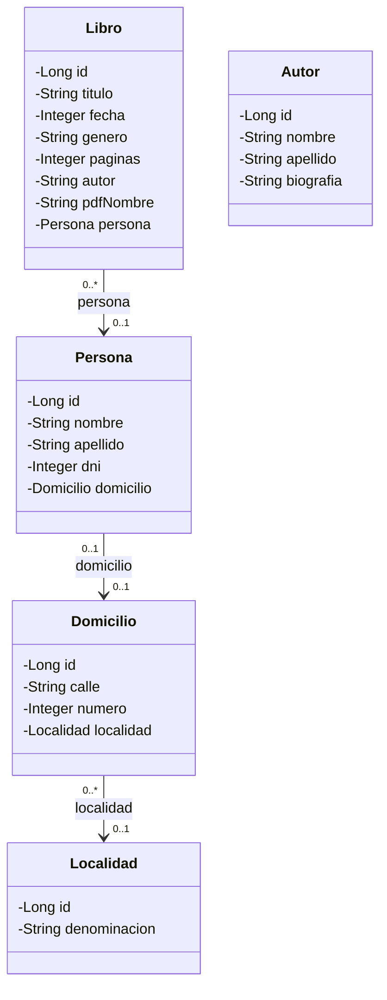
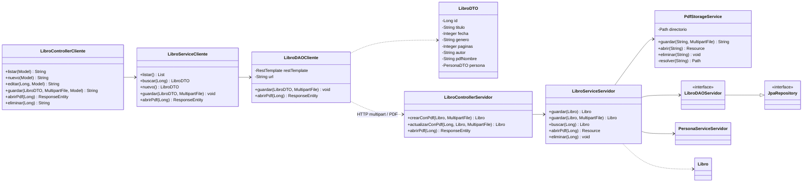

# Diagrama de clases: Ejercicio 1d

El modelo del ejercicio 1c incorpora `Libro.pdfNombre` para persistir el nombre del PDF.
El archivo se guarda en el sistema de archivos del servidor. `PdfStorageService` concentra
la validacion del archivo, la generacion del nombre y su almacenamiento y lectura.

## Modelo del servidor

`Autor` se conserva como entidad del punto c; el libro mantiene su autor en un campo
de texto, por lo que no existe una asociacion JPA entre ambas clases.

## Clases que intervienen en la carga y consulta del PDF

Los sufijos Cliente y Servidor distinguen clases con el mismo nombre en aplicaciones
diferentes; en el codigo ambas se llaman `LibroController` o `LibroService`.

La carga envia una parte JSON `libro` y una parte opcional `pdf`. El servicio del servidor
guarda el archivo y su nombre en SQLite. Al consultar el libro, el enlace `target="_blank"`
abre `/libros/{id}/pdf` en una pestana nueva; el cliente obtiene el contenido de
`/api/libros/{id}/pdf`, cuya respuesta usa `application/pdf` y `Content-Disposition: inline`.

`ApiExceptionHandler` entrega errores de validacion desde la API y `UploadExceptionHandler`
informa al usuario cuando el archivo supera el limite configurado.
